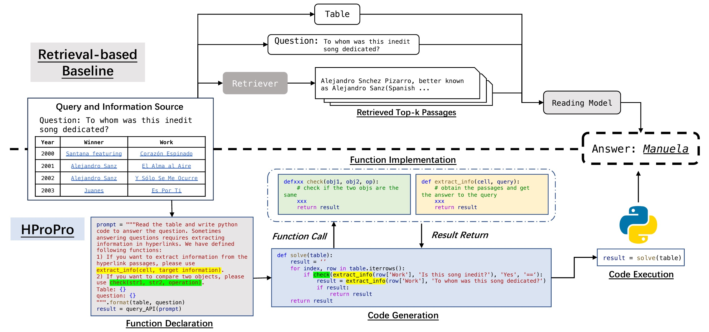

# HProPro

Code for paper [Exploring Hybrid Question Answering via Program-based Prompting (ACL 2024)](https://arxiv.org/pdf/2402.10812.pdf).


## Introduction

Question answering over heterogeneous data requires reasoning over diverse sources of data, which is challenging due to the large scale of information and organic coupling of heterogeneous data. Various approaches have been proposed to address these challenges. One approach involves training specialized retrievers to select relevant information, thereby reducing the input length. Another approach is to transform diverse modalities of data into a single modality, simplifying the task difficulty and enabling more straightforward processing. In this paper, we propose HProPro, a novel program-based prompting framework for the hybrid question answering task. HProPro follows the code generation and execution paradigm. In addition, HProPro integrates various functions to tackle the hybrid reasoning scenario. Specifically, HProPro contains function declaration and function implementation to perform hybrid information-seeking over data from various sources and modalities, which enables reasoning over such data without training specialized retrievers or performing modal transformations. Experimental results on two typical hybrid question answering benchmarks HybridQA and MultiModalQA demonstrate the effectiveness of HProPro: it surpasses all baseline systems and achieves the best performances in the few-shot settings on both datasets.



## Dependencies

* Prepare the system environment.
```bash
conda env create -f HProPro.yaml
```


## Running

1. Prepare the system environment.
```bash
export PYTHONPATH=xxx/HProPro
conda activate HProPro
```

2. Add key
```
export OPENAI_API_KEY="your-api-key-here"
```

3. Run code
```
# For HybridQA
bash run_mt.sh
# For MMQA
bash run_mmqa_mt.sh
```
You can customize the required parameters in:
* For HybridQA
    * run_mt.sh
    * run_mt_oracle.sh
    * run_mt_end2end.sh
    * run_single.sh
* For MMQA
    * run_mmqa_*.sh


## Citation
```
@misc{shi2024exploring,
      title={Exploring Hybrid Question Answering via Program-based Prompting}, 
      author={Qi Shi and Han Cui and Haofeng Wang and Qingfu Zhu and Wanxiang Che and Ting Liu},
      year={2024},
      eprint={2402.10812},
      archivePrefix={arXiv},
      primaryClass={cs.CL}
}
```
